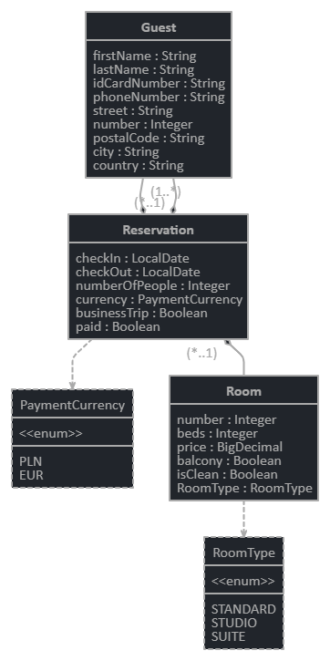

# MangoRoom

Project build by 5 girls passionate about programming, who would like to start work as Java developers. This application will allow managing reservations in hotel rooms. We will use: Java 11,  Spring Web, Maven, H2 Database, JPA, Lombok, jUnit, Mockito.

### Prerequisites

[Java 11](https://adoptopenjdk.net/)

## Relationships in MangoRoom database

## Authors

- **Anna Postek** - [LinkedIn Profile](https://www.linkedin.com/in/anna-postek/)
- **Anna ...** - [LinkedIn Profile](https://www.linkedin.com/in/anna-postek/)
- **Barbara Tyndorf** - [LinkedIn Profile](https://www.linkedin.com/in/barbara-tyndorf/)
- **Dong Ha Kotwa** - [LinkedIn Profile](https://www.linkedin.com/in/dh-kotwa/)
- **Paulina Kubiak** - [LinkedIn Profile](https://www.linkedin.com/in/paulina-ewa-kubiak/)